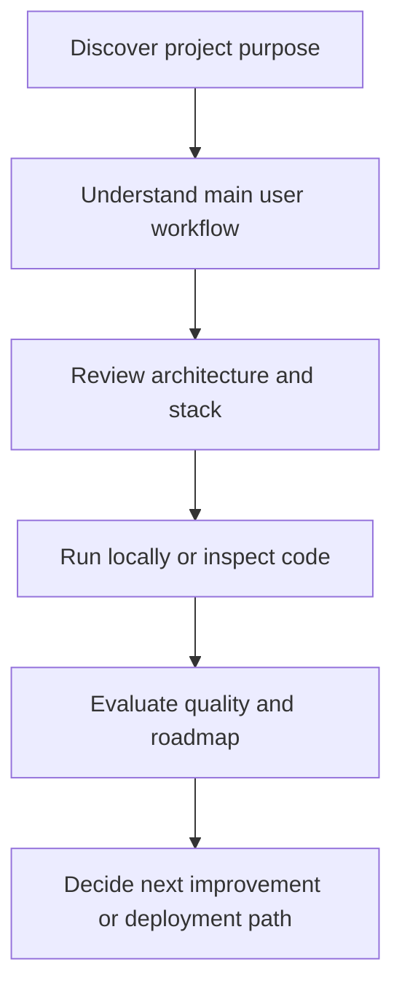
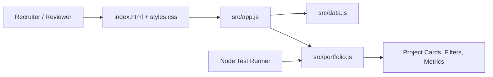
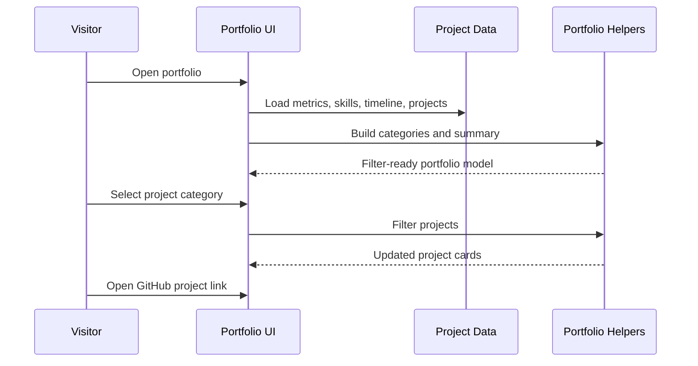

<div align="center">

# Bheda Nikhilkumar Portfolio — Working Portfolio Website

### Responsive developer portfolio website showcasing projects, skills, timeline, and GitHub proof-of-work.


**Repository:** [bhedanikhilkumar-code/Bheda-Nikhilkumar-portfolio](https://github.com/bhedanikhilkumar-code/Bheda-Nikhilkumar-portfolio)

<!-- REPO_HEALTH_BADGE_START -->
[](https://github.com/bhedanikhilkumar-code/Bheda-Nikhilkumar-portfolio/actions/workflows/repository-health.yml)
<!-- REPO_HEALTH_BADGE_END -->

<!-- APP_QUALITY_BADGE_START -->
[](https://github.com/bhedanikhilkumar-code/Bheda-Nikhilkumar-portfolio/actions/workflows/app-quality.yml)
<!-- APP_QUALITY_BADGE_END -->

</div>

---

## Executive Overview

This repository is now a working **responsive portfolio website** for Nikhil Bheda. It presents a recruiter-friendly hero section, project highlights, skills, timeline, portfolio metrics, and GitHub call-to-action using vanilla HTML, CSS, and JavaScript.

The project was upgraded from a documentation-only repository into a runnable static web app with structured portfolio data, pure helper functions, Node.js unit tests, validation scripts, and GitHub Actions quality checks.

## Product Positioning

| Question | Answer |
| --- | --- |
| **Who is it for?** | Users, reviewers, recruiters, and developers who want to understand the project quickly. |
| **What problem does it solve?** | It gives reviewers a polished single-page view of projects, strengths, proof-of-work, and GitHub readiness. |
| **Why it matters?** | The project demonstrates product thinking, stack selection, feature planning, and clean documentation discipline. |
| **Current focus** | Working portfolio UI, project data model, test coverage, and CI-backed quality checks. |

## Repository Snapshot

| Area | Details |
| --- | --- |
| Visibility | Public portfolio repository |
| Primary stack | `HTML5`, `CSS3`, `Vanilla JavaScript`, `Node.js tests` |
| Repository topics | `personal-website`, `portfolio`, `web-app`, `vanilla-javascript`, `github-pages` |
| Useful commands | `npm start`, `npm test`, `npm run check` |
| Key dependencies | Zero runtime dependencies; Node.js is used for preview, tests, and validation |

## Topics

`personal-website` · `portfolio` · `web-app` · `vanilla-javascript` · `github-pages`

## Key Capabilities

| Capability | Description |
| --- | --- |
| **Recruiter-ready landing page** | Presents identity, role, strengths, metrics, project highlights, and GitHub CTA. |
| **Featured Projects** | Highlights mobile, AI, full-stack, productivity, and automation repositories with impact notes. |
| **Interactive filtering** | Lets visitors filter selected work by category from structured project data. |
| **Tested data helpers** | Portfolio categories, search, summary, stack extraction, and repo labels are covered by Node tests. |
| **Professional polish** | Responsive dark UI with strong visual hierarchy, timeline, metrics, and skill cloud. |

<!-- PROJECT_DOCS_HUB_START -->

## Documentation Hub

| Document | Purpose |
| --- | --- |
| [Architecture](docs/ARCHITECTURE.md) | System layers, workflow, data/state model, and extension points. |
| [Case Study](docs/CASE_STUDY.md) | Product framing, decisions, tradeoffs, and portfolio story. |
| [Roadmap](docs/ROADMAP.md) | Practical next steps for turning the project into a stronger product. |
| [Quality Standard](docs/QUALITY.md) | Repository health checks, review standards, and quality gates. |
| [Review Checklist](docs/REVIEW_CHECKLIST.md) | Final share/recruiter review checklist for a stronger GitHub impression. |
| [Contributing](CONTRIBUTING.md) | Branching, commit, review, and quality guidelines. |
| [Security](SECURITY.md) | Responsible disclosure and safe configuration notes. |
| [Support](SUPPORT.md) | How to ask for help or report issues clearly. |
| [Code of Conduct](CODE_OF_CONDUCT.md) | Collaboration expectations for respectful project activity. |

<!-- PROJECT_DOCS_HUB_END -->

## Detailed Product Blueprint

### Experience Map



### Feature Depth Matrix

| Layer | What reviewers should look for | Why it matters |
| --- | --- | --- |
| Product | Clear user problem, target audience, and workflow | Shows product thinking beyond tutorial-level code |
| Interface | Screens, pages, commands, or hardware interaction points | Demonstrates how users actually experience the project |
| Logic | Validation, state transitions, service methods, processing flow | Proves the project can handle real use cases |
| Data | Local storage, database, files, APIs, or device input/output | Explains how information moves through the system |
| Quality | Tests, linting, setup clarity, and roadmap | Makes the project easier to trust, extend, and review |

### Conceptual Data / State Model

| Entity / State | Purpose | Example fields or responsibilities |
| --- | --- | --- |
| User input | Starts the main workflow | Form values, commands, uploaded files, device readings |
| Domain model | Represents the project-specific object | Transaction, note, shipment, event, avatar, prediction, song, or task |
| Service layer | Applies rules and coordinates actions | Validation, scoring, formatting, persistence, API calls |
| Storage/output | Keeps or presents the result | Database row, local cache, generated file, chart, dashboard, or device action |
| Feedback loop | Helps improve the next interaction | Status message, analytics, error handling, recommendations, roadmap item |

### Professional Differentiators

- **Documentation-first presentation:** A reviewer can understand the project without guessing the intent.
- **Diagram-backed explanation:** Architecture and workflow diagrams make the system easier to evaluate quickly.
- **Real-world framing:** The README describes users, outcomes, and operational flow rather than only listing files.
- **Extension-ready roadmap:** Future improvements are scoped so the project can keep growing cleanly.
- **Portfolio alignment:** The project is positioned as part of a consistent, professional GitHub portfolio.

## Architecture Overview



## Core Workflow



## How the Project is Organized

```text
Bheda-Nikhilkumar-portfolio/
├── index.html                         # Portfolio page shell
├── package.json                       # Node scripts for preview, tests, and validation
├── src/
│   ├── app.js                         # DOM rendering, filtering, navigation interactions
│   ├── data.js                        # Profile, metrics, projects, skills, timeline
│   ├── portfolio.js                   # Pure helper functions covered by tests
│   └── styles.css                     # Responsive dark professional UI
├── tests/
│   └── portfolio.test.mjs             # Node unit tests for portfolio data/helpers
├── scripts/
│   ├── serve.mjs                      # Dependency-free local static server
│   └── validate-project.mjs           # Project structure and README validation
├── .github/workflows/
│   ├── app-quality.yml                # Node test + validation CI
│   └── repository-health.yml          # Documentation/community health CI
└── docs/                              # Architecture, case study, roadmap, quality notes
```

## Engineering Notes

- **Separation of concerns:** UI, business logic, data/services, and platform concerns are documented as separate layers.
- **Scalability mindset:** The project structure is ready for new screens, services, tests, and deployment improvements.
- **Portfolio quality:** README content is designed to communicate value before someone even opens the code.
- **Maintainability:** Naming, setup steps, and roadmap items make future work easier to plan and review.
- **User-first framing:** Features are described by the value they provide, not just the technology used.

## Local Setup

```bash
# Clone the repository
git clone https://github.com/bhedanikhilkumar-code/Bheda-Nikhilkumar-portfolio.git
cd Bheda-Nikhilkumar-portfolio

# Run unit tests
npm test

# Validate project structure and README details
npm run check

# Start local preview server
npm start
# Open http://localhost:4174
```

## Suggested Quality Checks

Before shipping or presenting this project, run the checks that match the stack:

| Check | Purpose |
| --- | --- |
| `npm test` | Runs Node.js unit tests for portfolio data, categories, search, summaries, and repo labels. |
| `npm run check` | Validates expected app, docs, workflow, and README structure. |
| GitHub Actions `app-quality.yml` | Runs tests and validation on every push/PR. |
| GitHub Actions `repository-health.yml` | Checks documentation, templates, and professional repo files. |
| Manual smoke test | Open local preview, filter projects, inspect responsive layout, and open GitHub links. |

## Roadmap

- Add live project demos
- Improve case-study pages
- Add contact workflow
- Track analytics responsibly

## Professional Review Checklist

- [ ] Clear project purpose and audience
- [ ] Feature list aligned with real user workflows
- [ ] Architecture documented with diagrams
- [ ] Setup steps tested on a clean machine
- [ ] Screenshots or demo GIFs added where possible
- [ ] Environment variables documented without exposing secrets
- [ ] Tests/lint commands documented
- [ ] Roadmap shows practical next steps

## Screenshots / Demo Suggestions

Add these assets when available to make the repository even stronger:

| Asset | Recommended content |
| --- | --- |
| Hero screenshot | Main dashboard, home screen, or landing page |
| Workflow GIF | 10-20 second walkthrough of the core feature |
| Architecture image | Exported version of the Mermaid diagram |
| Before/after | Show how the project improves an existing workflow |

## Contribution Notes

This project can be extended through focused, well-scoped improvements:

1. Pick one feature or documentation improvement.
2. Create a small branch with a clear name.
3. Keep changes easy to review.
4. Update this README if setup, features, or architecture changes.
5. Open a pull request with screenshots or test notes when possible.

## License

Add or update the license file based on how you want others to use this project. If this is a portfolio-only project, document that clearly before accepting external contributions.

---

<div align="center">

**Built and documented with a focus on professional presentation, practical workflows, and clean engineering communication.**

</div>
# Portfolio update
