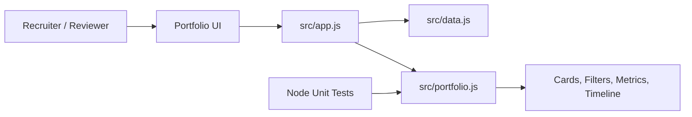
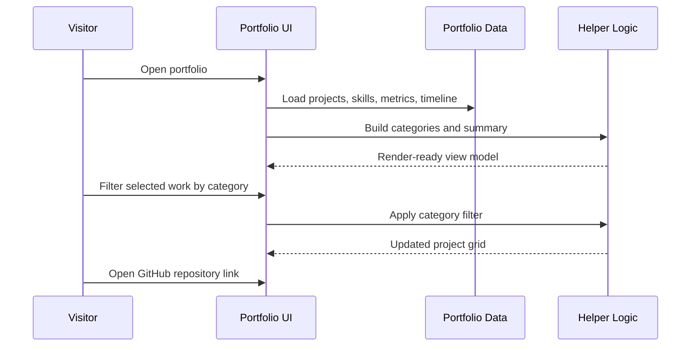
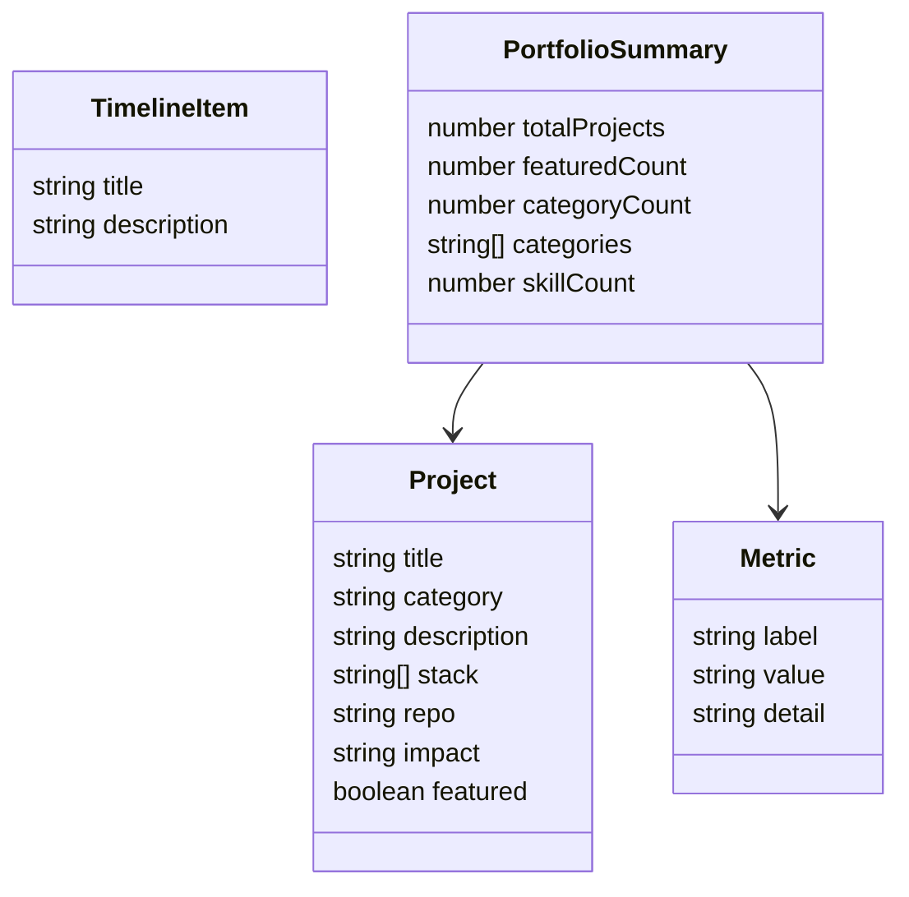

# Architecture — Bheda Nikhilkumar Portfolio

## Purpose

This repository is a responsive, recruiter-friendly portfolio website for Nikhil Bheda. It presents project highlights, skills, timeline, metrics, and GitHub links through a polished static web experience.

## System Context

## Runtime Boundaries

| Boundary | Responsibility | Files |
| --- | --- | --- |
| Page shell | Semantic sections, navigation, SEO metadata, call-to-action | `index.html` |
| Styling | Responsive dark UI, cards, grid layouts, mobile navigation | `src/styles.css` |
| Rendering | Creates metrics, filters, project cards, skill pills, and timeline entries | `src/app.js` |
| Data model | Profile, metrics, projects, skills, and timeline content | `src/data.js` |
| Pure helpers | Categories, filtering, search, stack extraction, summaries, validation | `src/portfolio.js` |
| Quality | Unit tests and structure validation | `tests/`, `scripts/`, GitHub Actions |

## Primary Workflow

## Data Model

## Quality Gates

- `npm test` validates portfolio helper behavior and project data completeness.
- `npm run check` validates expected files and README content.
- `.github/workflows/app-quality.yml` runs app tests and validation on push/PR.
- `.github/workflows/repository-health.yml` validates the professional repository layer.

## Extension Points

- Add GitHub Pages deployment.
- Add project detail pages or modal case studies.
- Add screenshots and preview GIFs.
- Add downloadable resume section.
- Add Playwright smoke tests for browser-level interactions.
